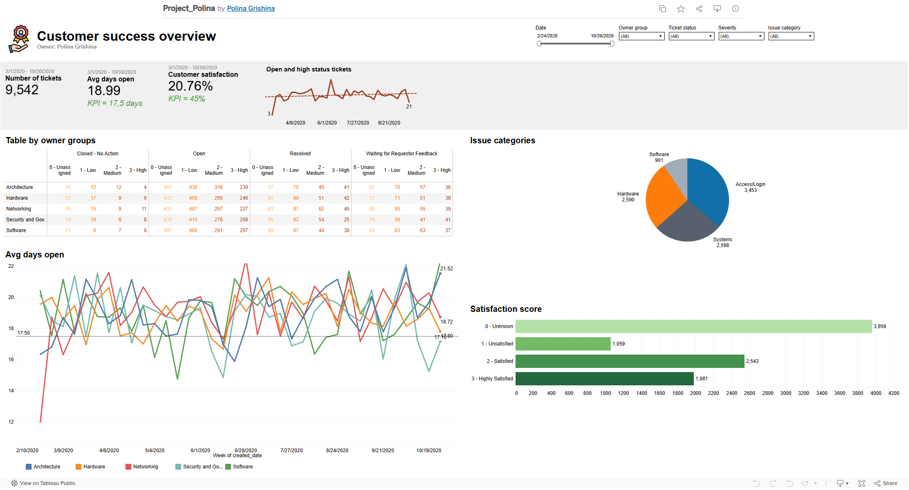

# Интерактивная отчётность для службы поддержки отелей в Tableau

## Суть проекта: 
автоматизация мониторинга ключевых метрик работы службы поддержки - создание дашборда в Tableau для отслеживания обработки тикетов, удовлетворённости клиентов, распределения нагрузки между командами.

## Основная цель:
Обеспечить оперативный мониторинг и анализ работы службы поддержки для:
* сокращения времени обработки тикетов (до целевого KPI - 17,5 дней);
* повышения удовлетворённости клиентов (до KPI - 45%);
* равномерного распределения нагрузки между 5 командами поддержки;
* быстрого выявления и устранения критических проблем (тикеты с серьёзностью «High»).

## Методы достижения цели:
1. Сбор и агрегация данных о тикетах из базы данных (количество, статусы, время обработки, удовлетворённость клиентов).
2. Разработка Dashboard Canvas - схемы дашборда с ключевыми метриками.
3. Визуализация данных в Tableau с использованием графиков, таблиц и индикаторов:
* графики динамики (например, «Avg days open»);
* круговые диаграммы (распределение по категориям проблем - «Issue categories»);
* таблицы с детализацией по группам ответственных («Table by owner groups»);
* индикаторы KPI (количество тикетов, удовлетворённость, среднее время обработки).
4. Реализация фильтрации данных по:
* категории проблемы (issue_category);
* уровню серьёзности (severity);
* группе ответственных (owner_group);
* статусу заявки (ticket_status).
5. Еженедельный анализ дашборда для планирования нагрузки и принятия управленческих решений.

## Используемый стек:
Tableau | Dashboard Canvas | PowerPoint

## Полученные результаты:
1. Создан интерактивный дашборд, отображающий ключевые метрики работы службы поддержки.
2. Реализована визуализация динамики времени обработки тикетов (график «Avg days open») и уровня удовлетворённости клиентов (диаграмма «Satisfaction score»).
3. Обеспечена детализация по группам ответственных (таблица «Table by owner groups») с разбивкой по уровням серьёзности и статусам тикетов.
4. Добавлена фильтрация данных для глубокого анализа проблемных зон.
5. Визуализировано распределение тикетов по категориям проблем (круговая диаграмма «Issue categories»).
6. Обеспечен мониторинг «зависших» тикетов (статус «Open») и тикетов с серьёзностью «High» для оперативного реагирования.
7. Упрощён процесс еженедельного анализа работы службы поддержки (дашборд заменяет ручной сбор данных).

## Главный вывод:
Внедрение дашборда в Tableau позволило службе поддержки:
* оперативно отслеживать ключевые метрики и KPI;
* быстро выявлять проблемные области (долгие тикеты, низкая удовлетворённость, перегрузка команд);
* принимать обоснованные решения по распределению нагрузки и улучшению качества обслуживания;
* повысить прозрачность работы для всех участников процесса (лиды, аналитики, руководство).
В результате улучшилось качество обслуживания клиентов и эффективность работы команд поддержки.

## Ознакомиться с файлом решения тут: [Dashboard-Tableau](https://public.tableau.com/views/Project_Polina/Dashboard?:language=en-US&publish=yes&:sid=&:redirect=auth&:display_count=n&:origin=viz_share_link)

